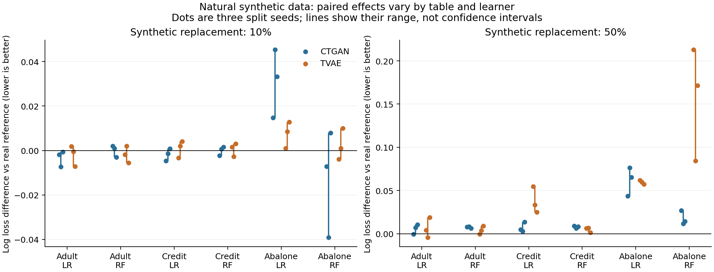
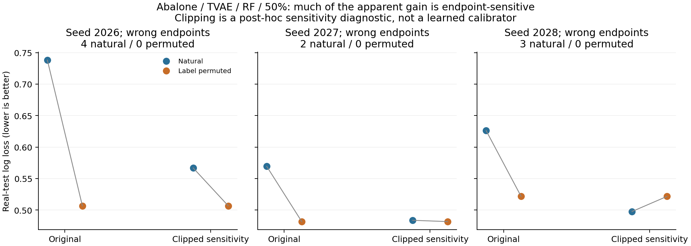
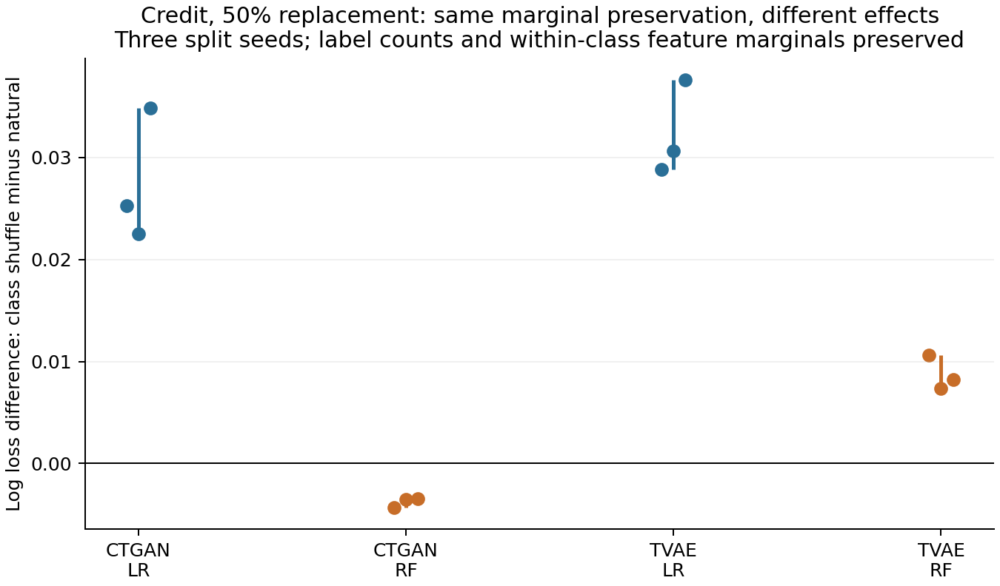

# E1 配对筛查结果分析与下一步研究计划

分析日期：2026 年 10 月 7 日。实验版本：`e1-paired-screen-v1`，运行代码提交 `d029e06`。性质：探索性分析。本文中的“稳定”仅指当前固定生成池上的三个划分种子方向一致，不能解释为跨数据集或跨生成器训练重复的统计确认。

## 1. 当前最重要的判断

这批实验已经为下一步缩小了问题范围。最值得追问的是：**合成数据的任务相关结构如何改变学习器的排序能力和概率置信度，为什么这些变化会导致不同风险指标、乃至治理选择给出不同判断？**

目前有两条较具体的线索。第一，某些“标签打乱后效用改善”的结果主要来自少数极端错误预测受到的 log loss 惩罚减轻；第二，保持标签比例和各特征类条件边际不变的类内重排，在 Credit 上对逻辑回归和随机森林产生不同响应。它们可以围绕“结构失真—模型响应—任务风险”形成同一条研究线。尾部欠覆盖目前证据较弱，适合作为边界和补充诊断。

这些结果足以支持继续做针对性诊断，尚不足以成为一篇 study 的核心结论。首要任务是解释现象、验证替代解释，再决定是否扩成 benchmark。

## 2. 这批实验实际回答了什么

数据为 Adult、Credit、Abalone；生成池为 CTGAN、TVAE；学习器为逻辑回归（LR）和随机森林（RF）；划分/抽样种子为 2026、2027、2028。训练集固定为 1000 行，替换比例为 0、10%、50%。每个表/种子共用真实训练核心与真实测试集，每个比例共用替换位置。

自然合成样本之外，比较三种受控操作：类内逐列重排、标签置换、按原标签计数抽取非尾部合成行。两个真实对照为原始真实核心，以及从独立真实储备中抽取同数量记录进行替换。所有模型均在真实留出测试集上评估。

实际执行 9 个分片，每片 42 次模型拟合，共 378 次。真实核心参照在三个比例下重复拟合，数据和模型随机性完全相同，因此这 378 行不是 378 个独立实验；去掉这部分重复参照后为 342 个唯一拟合条件。真正用于讨论跨划分变化的内部重复只有三个种子。每种生成器/表仅使用一个固定生成池，没有重新训练三个独立生成器。

本批没有检测器、比例估计器或清理策略，因而不能从它证明“检测误差已传导至下游风险”。它是在把传导链最后一段——数据如何影响任务学习器——解释清楚。

## 3. 核验结果与统计口径

对服务器原结果进行了 1,971 项核验，全部通过，包含：

- 配置、真实池和合成池哈希；九个分片的完整性、键唯一性及不可行记录。
- 按冻结随机规则重建真实核心、训练储备和测试索引，检查它们互不交叉。
- 378 个预测文件的测试样本 ID、任务标签和尾部分组完全对齐；由逐样本预测重算七项原有指标。
- 原始真实参照在各比例下的预测逐元素相同；所有条件训练规模为 1000。
- 共用替换位置、合成池行索引、混合后标签比例及尾部比例均与记录一致。
- 类内重排确实保持每类每列的值集合；标签置换保持特征行及标签计数；尾部欠覆盖保持标签计数并排除预定义尾部。

审计读取预测 CSV 时采用 `float_precision="round_trip"`。普通浮点解析曾使部分 RF 分数的并列关系产生微小变化，导致排序指标无法在严格容差内逐位重算；精确读取后原指标全部复现。该问题来自分析读取精度，不需要重跑模型。

本报告使用三类配对差值，不能混在一起：

\[
\Delta_{real}=L(混合训练)-L(原始真实核心),
\]
\[
\Delta_{donor}=L(混合训练)-L(同数量独立真实替换),
\]
\[
\Delta_{intervention}=L(受控操作后的混合训练)-L(自然合成混合训练).
\]

log loss 和 Brier 的差值为正表示变差，AUROC 和 AUPRC 的差值为正表示变好。下文报告三个种子的均值，必要时给出最小值至最大值；图中的线段也是种子范围，不是置信区间。没有将三个种子当成足够的总体样本进行显著性声明，也没有使用同一测试集挑选新模型参数。

## 4. 主要结果

### 4.1 相同合成比例对应的风险差异很大

下表是自然生成池在 50% 替换时相对原始真实核心的平均 log loss 差值。

| 数据集 | 学习器 | CTGAN | TVAE |
|---|---|---:|---:|
| Adult | LR | +0.00575 | +0.00623 |
| Adult | RF | +0.00747 | +0.00409 |
| Credit | LR | +0.00712 | +0.03763 |
| Credit | RF | +0.00776 | +0.00488 |
| Abalone | LR | +0.06172 | +0.05945 |
| Abalone | RF | +0.01763 | +0.15629 |

12 个表—模型—生成器组合的平均值均为正，但 Adult 的若干组合并非三个种子都为正。10% 替换时，Adult 和 Credit 多数变化接近零，Abalone 的变化较大、模型差异也更明显。不能据此写成“任何比例的合成数据都会显著损害模型”。

同数量真实替换对照也会波动。例如 Adult/RF/50% 的真实替换平均差值为 +0.00529，TVAE 为 +0.00409；相对独立真实替换，TVAE 的差值反而约为 −0.00120。Abalone/RF/50% 的真实替换为 −0.01823，TVAE 相对该对照的差值约为 +0.17452。真实替换对照有助于分离“更换一部分训练样本”与“换成合成样本”这两种效应。



这一结果支持把“污染率”降为场景变量之一：它不能独立刻画任务风险。它尚未告诉我们哪个结构指标可以在新数据上预测风险。

### 4.2 最值得先解释的反例：标签置换使 log loss 下降，但其他指标变差

50% 替换时，比较标签置换与同一批自然合成样本，出现如下两个例子：

| 条件 | Δlog loss | ΔBrier | ΔAUROC | 三个种子 log loss 是否都下降 |
|---|---:|---:|---:|---|
| Abalone / TVAE / RF | −0.14130 | +0.00405 | −0.00771 | 是 |
| Credit / TVAE / LR | −0.01854 | +0.00456 | −0.02327 | 是 |

这不能解释为“标签越乱，数据越好”。log loss 下降与平均 Brier、AUROC 变差同时存在，说明这里需要拆分概率估计和排序表现。自然合成标签也不是已知正确标签；在没有生成样本任务真值的情况下，只能称为标签关系置换，而不能准确计算其真实标签错误率。

Abalone/TVAE/RF 的逐样本结果进一步揭示了极端概率的影响：

| 种子 | 自然合成 log loss | 标签置换 log loss | 自然合成错误端点数 | 自然合成截断后 loss | 标签置换截断后 loss |
|---|---:|---:|---:|---:|---:|
| 2026 | 0.73823 | 0.50670 | 4 | 0.56674 | 0.50670 |
| 2027 | 0.56934 | 0.48163 | 2 | 0.48364 | 0.48163 |
| 2028 | 0.62624 | 0.52160 | 3 | 0.49759 | 0.52160 |

“错误端点”指真实为正却预测概率为 0，或真实为负却预测概率为 1。每个 Abalone 测试集只有 679 行，2—4 个这种预测就会对 log loss 造成明显影响。自然合成条件中最差 1% 测试样本贡献了约 24%—32% 的总 log loss；标签置换后约为 4%—5%。

将概率统一截断到 [0.001, 0.999]，只用于事后敏感性诊断，平均差值从 −0.14130 缩至 −0.01268，幅度减少约 91%；种子 2028 的方向还发生反转。这表明原先的大幅优势高度依赖极端置信度的惩罚。截断不是学到的校准器，不能将这 91% 声称为已经识别的“校准中介效应”，也不能据此替换预定主指标。

Credit/TVAE/LR 的变化经相同截断后仍为 −0.01536，三个种子均为负，不能完全归于恰好为 0/1 的概率。其正类平均损失减少 0.10656，负类平均损失增加 0.00648；同时 Brier 和 AUROC 变差。下一步应检查哪些正类样本的严重错误被缓和，以及这种缓和是否以更广泛的排序或中等概率质量损失为代价。



可检验的解释是：标签置换改变了模型学到的关系并减弱某些极端置信度，因而缓和少量严重错误，但可能同时破坏了总体排序。这目前是候选解释。没有独立验证集上的校准实验，不能直接宣称“证明了校准机制”。

### 4.3 类内结构扰动具有学习器依赖性

类内重排保持标签计数以及各特征在每个类别中的边际分布，仅重新组合行内特征。在 Credit、50% 替换条件下，相对自然合成样本的配对变化为：

| 生成器 | 学习器 | 平均 Δlog loss | 三种子范围 | 平均 ΔBrier | 平均 ΔAUROC |
|---|---|---:|---:|---:|---:|
| CTGAN | LR | +0.02754 | [0.02250, 0.03485] | +0.00512 | −0.00331 |
| CTGAN | RF | −0.00376 | [−0.00434, −0.00345] | −0.00113 | +0.00807 |
| TVAE | LR | +0.03235 | [0.02883, 0.03759] | +0.00365 | −0.00067 |
| TVAE | RF | +0.00874 | [0.00737, 0.01062] | +0.00241 | +0.00080 |

CTGAN 的方向在 LR 与 RF 之间相反，且各自在三个种子上方向一致；TVAE 没有出现同样的 RF 改善。这不是“破坏结构总有害”，也不是“RF 总比 LR 鲁棒”。更具体的问题是：**哪种生成器产生的联合关系，会被哪种学习器利用或误用？**

数值特征的类内相关矩阵诊断显示，Credit/CTGAN 的相关误差均值从自然样本的约 0.1199 增至重排后的 0.2267，但 RF 的三项指标改善。这是“这一个相关性保真度诊断不完全代表这一个任务的效用”的实例。该诊断仅覆盖数值相关，不是完整联合结构或因果结构度量；不能把它提升为“结构保真度越差越好”。



还需要对真实储备样本进行相同重排，确认该现象是否只是学习器对相关特征的一般响应；也需要改变重排强度、独立重抽合成子集，并检查预处理、RF 叶节点规模与模型参数是否改变结论。

### 4.4 尾部欠覆盖暂不适合成为主线

尾部被定义为真实训练核心中 age、LIMIT_BAL 或 length 的上 10% 区域。该定义是预先固定的诊断区域，不能等同于少数类别、困难样本或因果上重要的稀有群体。

50% 替换时，尾部欠覆盖相对自然条件的整体 log loss 在 Abalone/LR 上三个种子均增加，但 Adult 和 Credit 的多个组合很小或方向不一致，尾部测试损失也没有统一变化方向。更重要的是，这种干预重新抽取了整行合成数据，同时可能改变其他特征分布，虽然保持了标签计数，却没有单独隔离覆盖的作用。

一个具体例子是 Abalone/CTGAN：自然抽样的合成子集在 length 高值尾部的覆盖率平均约 48.3%，已经远高于真实核心的约 10%。从这样的池中排除尾部，不只是引入“欠覆盖”，还纠正或改变了原有分布偏移。后续如果研究尾部，应围绕真实任务相关区域、覆盖强度和重加权/重抽样对照重新设计，不能直接扩展当前操作后宣称普遍结论。

## 5. 统一研究逻辑与前两层的位置

目前可以把下一阶段组织成以下链条：

```text
任务相关数据结构：标签关系、联合特征关系、局部覆盖
                    ↓
学习器响应：排序能力、置信度分布、局部错误集中程度
                    ↓
任务风险：log loss / Brier / AUROC / 预定义组别损失
                    ↓
治理判断：保留、删除、降权，是否真正改善目标风险
```

检测与比例估计随后进入“治理判断”的上游：来源分数及其校准改变估计比例和删样本集合；保留集合的结构又影响模型响应。这样前两层提供信息和动作，第三层负责检验动作价值，而不是三个任务分别争取一个分数。

这里必须区分两个校准：**来源检测校准**调整“这行是合成数据的概率”；**下游任务校准**调整“这行任务标签为正的概率”。E1 揭示的概率问题属于后者，不能据此声称前者已被验证。未来可以研究它们如何共同影响治理判断，但不应现在同时扩成两个大矩阵。

研究主线可以暂定为：“合成数据的结构失真何时会转化为实际预测风险，学习器和概率估计方式如何改变这种转化，来源驱动的治理是否因此作出错误选择？”最后一句要由后续策略实验补齐，不是本轮已有结论。

## 6. 哪些前沿成果需要读，以及我们与它们的差别

以下为截至 2026-10-07 的针对性检索，优先使用会议、期刊、arXiv 和作者代码等一手来源。未声称穷尽所有最新工作；检索核对与完整精读也应分开记录。

| 优先级 | 文献与状态 | 重点阅读与对我们的约束 |
|---|---|---|
| 立即 | Jiang, Simidjievski, Jamnik. **TabStruct: Measuring Structural Fidelity of Tabular Data**, ICLR 2026。[官方论文页](https://proceedings.iclr.cc/paper_files/paper/2026/hash/447ac93bf22099aa346a45577376492d-Abstract-Conference.html)、[代码](https://github.com/SilenceX12138/TabStruct) | 阅读结构保真度、global utility 及跨预测器评估设计。结构与任务效用不一致已有系统研究；我们的价值必须进一步体现为失真×学习器×风险的条件机制及治理后果。 |
| 立即 | **Fidelity-agnostic synthetic data generation improves utility while retaining privacy**, Patterns, 2025, DOI 10.1016/j.patter.2025.101287。[论文](https://pmc.ncbi.nlm.nih.gov/articles/PMC12546680/) | 该研究强调面向特定任务保留相关信息，而不必复制所有统计模式。阅读它如何定义“任务相关”与设计效用比较，避免把“低保真也可能有用”包装成我们的新发现。 |
| 立即 | Barreñada 等. **Understanding overfitting in random forest for probability estimation: a visualization and simulation study**, Diagnostic and Prognostic Research 8:14, 2024。[论文](https://doi.org/10.1186/s41512-024-00177-1) | 虽非最新一年，却直接解释本轮异常。重点看叶节点规模、局部概率峰、判别与概率估计的区别，指导最小 RF 敏感性实验。 |
| 立即 | Kim, Huang, Liu. **An empirical study on impact of label noise on synthetic tabular data generation**, Machine Learning 114:90, 2025。[论文](https://link.springer.com/article/10.1007/s10994-024-06629-5) | 它主要对生成器训练数据引入噪声，我们目前对生成后的样本做标签置换；两种噪声位置不同。文中也讨论局部性能反升，不能把“噪声偶尔改善”本身当作充分创新。 |
| 第二批 | Zhang 等. **TabQueryBench: A Query-Centric Benchmark for Synthetic Tabular Data**, arXiv:2607.03926, 2026-07-04 预印本。[论文](https://arxiv.org/abs/2607.03926)、[代码](https://github.com/TabQueryBench/TabQueryBench) | 阅读局部条件查询与尾部覆盖评估；用于改善尾部定义及 benchmark 的场景模板，不急着加入全部查询工作负载。 |
| 第二批 | Das 等. **CoMedBench: A Multi-Source Benchmark of Synthetic Medical Data Fidelity and Downstream Utility**, arXiv:2608.12805，2026-08-17 v2 预印本。[论文](https://arxiv.org/abs/2608.12805) | 参考多来源、多任务和统一评估引擎，尤其不同指标下的效用差异。当前只核对公开摘要和版本，完整方法及统计设计仍需精读。 |
| E2 前 | Garrido 等. **Not all Jensen-Shannon Divergence Estimators are Equal**, arXiv:2606.16411, 2026 预印本。[论文](https://arxiv.org/abs/2606.16411) | 分类器型分布比较会受估计协议、先验及校准影响。用于规划来源分数与分布距离诊断的边界，避免把估计器行为当成数据本身属性。 |

本轮最值得精读的是前四篇，之后再根据诊断结果决定是否加深尾部和 benchmark 文献。相关领域已有的结论是我们需要控制或解释的基础，不应只作为引用背景。

## 7. 下一步工作：分成有退出条件的小批次

### 7.1 第一优先级：拆清概率置信度与实际预测能力

目的：判断标签置换导致的 log loss 改善，有多少来自 RF 概率端点或一般概率估计问题，有多少来自原始合成标签关系误导模型。

先用三个代表场景：Abalone/TVAE、Credit/TVAE、Adult/CTGAN。前两个来自异常例子，第三个作为标签置换明显损害预测的参照。先固定 50% 替换和现有三个种子，明确属于同一探索数据上的机制诊断。

数据条件为纯真实核心、等量真实替换、自然合成替换、标签置换合成替换。学习器为原 LR，以及 RF 的 `min_samples_leaf=3/10/30` 三个预设设置；其他参数保持一致。最多 3 场景 × 3 种子 × 4 数据条件 × 4 学习器设置 = 144 次任务模型拟合。禁止根据最终测试集选择其中最优设置后再称为公平提升。

另从训练储备中划出 500 行真实校准集，与核心、真实替换储备和最终测试集均不相交。所有条件使用同一信息预算，分别报告原始概率与预先固定的单调 sigmoid 校准。该校准只拟合独立校准集；最终测试集只评估。现有模型未保存，故需要重训这些小条件，并保存完整模型、预处理器、各划分 ID 和验证/测试预测。

主要观察：未经截断的预定 log loss、Brier、AUROC/AUPRC、错误端点数、分位数损失贡献、正负类损失。概率截断曲线仍只作为敏感性诊断。比较自然数据与置换数据在相同模型设置、相同校准方式下的差异，不能拿“校准自然模型”与“未校准置换模型”直接比较。

判别规则：

- 若改变叶节点规模或独立校准后，标签置换的优势大幅缩小，而排序仍变差，优先解释为概率估计/置信度效应；继续研究哪些合成结构诱发这类错误。
- 若优势跨多个模型设置、独立校准后仍稳定，并在合理任务损失上存在，则进一步排查原始合成标签关系的错误模式。
- 若只在少数种子或个别极端记录上出现，则将其定位为评分与稳健性案例，不能作为普遍的“合成数据机制”主结论。

### 7.2 第二优先级：确认结构扰动与学习器的交互

先聚焦 Credit/CTGAN，并把 Credit/TVAE 作为生成器对照。比较自然合成、类内重排合成、独立真实替换和类内重排真实替换。LR/RF、三个种子，两个生成器场景的原始上限为 48 次拟合，生成器无关的真实对照可以复用。

先验证完整重排的模型差异能否复现；若成立，再增加 25%、50%、100% 重排强度，并在训练数据定义的相关特征块上进行局部重排。记录实际结构变化、模型系数/预测变化与局部风险，避免仅用一个相关系数解释全部联合关系。

下一小步应使用具有已知标签机制的玩具任务：一个以加性关系为主，一个包含明确交互关系。在相同标签比例和类条件边际约束下改变联合结构，检查何时各学习器受损。玩具结果用于说明可能机制，真实多表结果用于验证边界。

若真实储备也出现同样响应，则结论主要是学习器与相关结构的一般关系，需要说明合成数据为何特别容易制造这种结构变化；若只有特定合成池出现，则进一步检查生成器特定伪关联与支持集问题。

### 7.3 第三优先级：把机制接回治理动作

在前两批确定一个值得追的机制后，再冻结一个可信来源检测器及其样本分数，先用少量量化器（CC、PACC）与明确的信息条件研究动作。动作至少包含保留、固定数量来源高分删除、同数量随机删除和来源 oracle 删除；来源 oracle 不等于任务最优上界。

记录删掉哪些样本、保留多少真实/合成样本、类别和任务相关区域如何变化，然后在相同下游设置下评估风险。概率校准、治理触发阈值和删样本排序需分别干预。固定 top-k 时的严格单调分数变换应保持删除集合不变；这可作为实现负对照。

这一阶段真正想检验的是：来源净化更成功，是否一定让任务风险更低；若不成立，差异能否由被删除的信息和模型响应解释。当前 E1 尚未为这个结论提供直接证据。

### 7.4 确认性扩展与 benchmark 门槛

只有候选机制经以上小批次仍成立，才增加独立生成器训练种子、结构不同的生成方法、未参与挑选假设的数据集和适当训练规模。重复划分同一固定池无法替代独立训练生成器。后续新划分也可能与旧测试样本重叠，因此严格的外部确认优先使用未参与探索的新表或真正独立保留数据。

扩展前冻结主要风险指标、信息预算、模型调参规则和失败处理。先报告逐数据集效应与反例，再考虑跨表汇总。新的 benchmark 应提供可复查的“数据失真—模型预测—治理动作—任务风险”链、场景卡与方法接口，而不是仅增加模型数量或排行榜。

如果不能获得稳定且有解释力的交互机制，就应把 E1 定位为范围有限的探索结果，收窄研究问题；不能为了形成 finding 而事后改指标、挑数据或把少数种子当成充分统计证据。

## 8. 工程与实验设计需要补齐的地方

1. 保存完整的真实核心、储备、验证与测试 ID，保存训练模型及预处理器；当前只能靠冻结代码和源数据重建部分训练记录。
2. 明确类别特征模式。Credit 中一些整数编码被现有预处理当成数值；后续应按预设 schema 检查一种合理编码敏感性，不能把编码差异误认成生成机制。
3. 让重启校验同时检查代码版本、环境和数据哈希。当前运行器跳过完成分片时只比较配置与 registry 哈希，若源池内容被改而 registry 文本未改，会留下风险；本轮已另行逐池校验，实际源池一致。
4. 把尾部干预的“逐行标签改变数”与标签噪声区分。尾部干预换了行，该字段不表示同一实例标签被改，不应进入噪声解释。
5. 当前 0 比例是复用纯真实参照，不包含每个生成器干预路径的独立零比例分支；可以证明参照预测一致，但覆盖的代码路径有限。
6. 增加独立无信息扰动负对照与真实样本上的同类操作对照；当前机制归因仍缺这两项。

这些是下一批应明确修补的边界，不影响本轮已核验的数值本身。

## 9. 交付物与复查入口

- 原始实验本地副本：`outputs/e1-paired-screen-v1/`。
- 审计与详细分析：`outputs/e1-analysis-20261007-v1/`，含 `audit_summary.json`、`audit_checks.csv`、`input_hashes.json`、`all_metrics.csv`、`paired_contrasts.csv`、`descriptive_summary.csv`、`structure_diagnostics.csv`。
- 审计程序：`reproduction/scripts/analyze_e1.py`；绘图程序：`reproduction/scripts/plot_e1_analysis.py`。
- 服务器原实验未改写；本轮只重算缓存结果，没有启动新的训练实验。

当前建议的执行顺序是：精读四篇直接相关文献并细化假设 → 小规模概率估计/校准诊断 → 结构×学习器对照 → 有条件地接回检测与治理。每一步都用上一步结果决定是否值得继续扩展。
